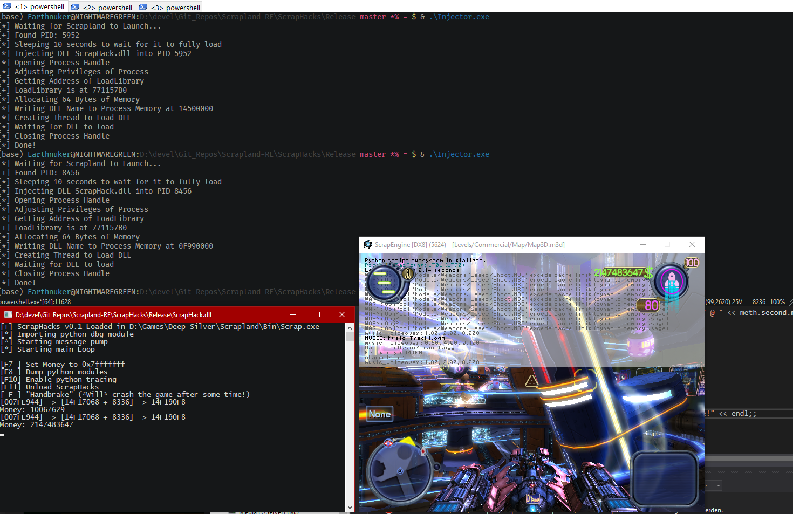

## Usage

0. Download `DirectX.8.0a.SDK.zip` from [here](https://archive.org/download/DirectX.8.0a.SDK_includes_libs_only)
1. Extract `DirectX.SDK/8.0/include` and `DirectX.SDK/8.0/lib` to `ScrapHacks/ScrapHack/dx8/include` and `ScrapHacks/ScrapHack/dx8/lib`
2. Add include and library dirs to project
3. Build Project
4. Run Injector `.\Injector.exe <Path to Scrap.exe>`
5. Wait for game to crash
6. Comment out `hook_d3d8()` call in `ScrapHack.cpp:DllPreInit()` 
7. Rebuild and run Injector again

```
[F3 ] Unload ScrapHacks
[F7 ] Set Money to 0x7fffffff
[F8 ] Dump python modules to console
[F10] Enable python tracing
[ F ] "Handbrake" (*Will* crash the game after some time!)
```