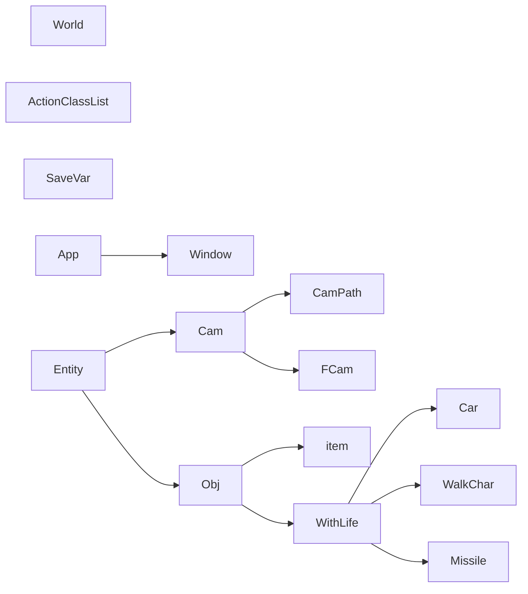

# Classes

<!-- TODO: autogenerate? -->

`new()` @ 0x415ca0

`delete()` @ 0x415cb0

> Lots of constructor calls at `0x68367b`

|      Name       |  Size  | Constructor |   VMT    | Inherits From |
| --------------- | ------ | ----------- | -------- | ------------- |
| Action          | 0xc    | 0x584d50    | 0x790fe0 |               |
| ActionClassList | 0x724  | 0x582eb0    | 0x790fb4 |               |
| App             | ???    | 0x4023e0    | 0x78b4d8 |               |
| Cam             | 0x13c  | 0x4b1210    | 0x78d2d8 | Entity        |
| CamPath         | 0x1788 | 0x4b1a50    | 0x78d340 | Cam           |
| Car             | 0x970  | 0x49b300    | 0x78cd40 | WithLife      |
| Entity          | 0x7c   | 0x4e97e0    | 0x78da88 |               |
| EntityList      | 0xa4   | 0x474d70    | ???      |               |
| FCam            | 0x274  | 0x4b28e0    | 0x78d3a8 | Cam           |
| Missile         | 0x9a4  | 0x4ec120    | 0x78db90 | WithLife      |
| Obj             | 0x288  | 0x4efa40    | 0x78dca8 | Entity        |
| SaveVar         | 0xc    | 0x416540    |          |               |
| WalkChar        | 0x760  | 0x4cdf90    | 0x78d4d8 | WithLife      |
| Window          | 0x88   | 0x4010e0    | 0x78b480 | App           |
| WithLife        | 0x544  | 0x4f2a60    | 0x78de00 | Obj           |
| World           | 0x225c | 0x479870    | 0x78cc6c |               |
| item            | 0x458  | 0x4ea790    | 0x78dad8 | Obj           |
| Py_Entity       | ????   | ???         | ???      |               |

## Class Inheritance

# Attributes (VMT index 16,17,18 for accessor functions)

## Entity

- LLogic
- Name
- Type
- EntityList
- NextInSlot
- NextInList

## FCam

- OnSwitch
- QuakeFactor
- MainTarget
- Target
- EntityLink
- QuakeFactor
- QuakeTime
- HSpeed
- VSpeed
- RetSpd
- CamDist
- CamAng
- CamRot
- AddTurn
- AddTurnSpeed

## Cam

- Fov
- clipNear
- clipFar
- 

## Obj

- OnEndMove
- CamName
- NetRes
- OnObjSlot
- LinkModel?

## item 

- TakeSound
- OnReset
- OnTake
- Owner
- TgTypeMarker

## Car

- Traf
- Model
- Target

## WithLife

- Descriptor
- Attacker
- ActCtrl
- HeadModel
- Pyromaniac
- OnDeath
- Hit?
- OnDamage
- CanPhoto
- AlwaysUse
- ArrowCanView
- ArrowCanMission
- ArrowCanUse
- ArrnOpt
- ArriOpt
- UseAngSel
- UseMapCheck
- UseAbsAngSel
